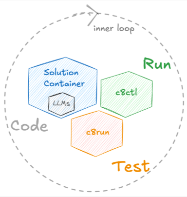

# Camunda Solutions Container

This container serves as a Docker Compose-based transport means for Camunda Business Solutions.  
The latter consist of predefinded, production-ready Building Blocks that are also Camunda applications.


The Camunda solutions Container serves well for Demo, Development and QA purposes but _must not_ be taken into Production as-is - because your specific infrastructure requirements might not be fully reflected here.

## Configuration

This host/port and all other hostnames and ports can be configured in a `.env`, see `.env.example` as a template.  
Also, all Building Blocks are expected to bring their own `.env` or `docker.env`, which will automatically be merged into the overall scope by Docker Compose.


## Base Services

An optional on-demand `camunda-check` service can check for a running Camunda instance on (per default) `localhost:8080`.
An LLM server must be running and reachable on `localhost:11434`.

Sample startup commands:

```bash
# Default startup (no optional profile services)
docker compose up -d

# Run Camunda availability check on demand
docker compose --profile checks up camunda-check

# Start optional local LLM stack (ollama + Open WebUI)
docker compose --profile ollama up -d

# Start everything including optional checks and LLM stack
docker compose --profile checks --profile ollama up -d
```

Sample stop commands:

```bash
# Stop and remove all running services from this compose project
docker compose down

# Stop optional local LLM stack services explicitly
docker compose stop ollama open-webui

# Stop Camunda check container if started on demand
docker compose stop camunda-check
```


- **ollama + Open WebUI** (optional, on-demand)

### `ollama`

`ollama:11434`

The dockerized `ollama` service is optional and does not start by default. Start it on demand if you want a local bundled LLM server. It serves on `localhost:11434`; `open-webui` is in the same profile and starts together with `ollama`.

### Open WebUI

`http://localhost:3000`


## Building Blocks

Building Blocks (any dir name containing `*_bb-*`) are considered ready to run artifacts that can be reused here as part of a "Business Solution". A sample is included as `BizSol_bb-sample`, showcasing the idea; the reuse of BPMN artifacts from `BizSol_bb-sample` happens in `my-solution/my-process.bpmn`.

## Development Accelerator

In conjunction with `c8run` and `c8ctl`, this setup is intended to enable "flight-mode" development, with no external network dependencies. This isolated environment in turn provides the fastest possible feedback loop for developing Camunda-based solutions.



`c8run`: https://downloads.camunda.cloud/release/camunda/c8run/  
`c8ctl`: https://www.npmjs.com/package/@camunda8/cli
